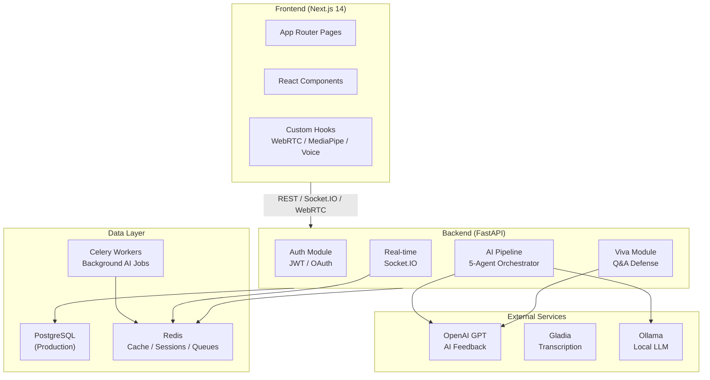

# AI Communication Coach 🤖🎤

[](https://github.com/yourusername/ai-communication-coach/actions/workflows/ci.yml)
[](https://codecov.io/gh/yourusername/ai-communication-coach)
[]()

> **Enterprise-grade AI SaaS platform for communication training with real-time coaching, multi-modal analysis, and gamified progression.**

[📊 Quality Assurance](./QUALITY_ASSURANCE.md) | [📖 API Docs](http://localhost:8000/api/v1/docs) | [🔧 Environment Setup](./env.example)

---

## ✨ Features

### 🎯 Core Capabilities
- **Voice Analysis** — Real-time speech recognition with Web Audio API pitch/energy detection
- **Face Analysis** — MediaPipe 478-point face landmark detection for eye contact, head pose, expressions
- **AI Coaching** — 5-agent orchestration (Conversation, Observer, Evaluator, Feedback, Psychology)
- **Multi-Modal Scoring** — Weighted fusion of voice (40%), face (40%), content (20%)
- **Real-time Feedback** — Live tips during sessions via Socket.IO
- **Multi-User Rooms** — WebRTC video/audio with AI observer for group sessions

### 🏗️ Training Modules
| Module | Description | Modes | Route |
|--------|-------------|-------|-------|
| **Group Discussion** | Collaborative discourse practice | Demo, Personal, AI, Friends | `/practice/*` |
| **Debate** | Argumentation and rebuttal skills | Demo, Personal, AI, Friends | `/practice/*` |
| **Presentation** | Public speaking with structure | Demo, Personal, AI, Friends | `/practice/*` |
| **JAM** | Just A Minute — fluency challenge | Demo, Personal, AI, Friends | `/practice/*` |
| **Interview** | Behavioral & technical prep | Demo, Personal, AI, Friends | `/practice/*` |
| **Viva/Q&A** | AI-powered defense training | AI | `/practice/viva` |

### 🎮 Gamification
- XP system with level progression
- Daily streak tracking
- Achievement badges (8 types)
- Global leaderboard with podium
- Team/organization support

### 📊 Analytics
- Score trends over time
- Skill radar chart (4 dimensions)
- Per-session detailed reports
- Performance history

---

## 🏗️ Architecture



---

## 🗺️ Feature → Implementation Mapping

| Feature | Backend | Frontend | Tests |
|---------|---------|----------|-------|
| **Authentication** | `app/api/v1/routes/auth.py` | `src/app/auth/` | `tests/test_api.py`, `tests/test_auth_security.py` |
| **Sessions** | `app/api/v1/routes/sessions.py` | `src/app/session/` | `tests/test_api.py`, `tests/test_audit.py` |
| **Viva/Q&A** | `app/api/v1/routes/viva.py` | `src/app/practice/viva/` | `tests/test_viva_and_ai.py` |
| **AI Pipeline** | `app/services/ai_pipeline/` | — | `tests/test_ai_pipeline.py`, `tests/test_scoring_engine.py` |
| **5-Agent System** | `app/services/agents/orchestrator.py` | — | `tests/test_orchestrator.py` |
| **Rooms (WebRTC)** | `app/api/v1/routes/rooms.py` | `src/app/room/` | `tests/test_audit.py` |
| **Analytics** | `app/api/v1/routes/analytics.py` | `src/app/analytics/` | `tests/test_api.py` |
| **Teams** | `app/api/v1/routes/teams.py` | `src/app/team/` | — |
| **Leaderboard** | `app/api/v1/routes/analytics.py` | `src/app/leaderboard/` | — |
| **Face Analysis** | `app/services/ai_pipeline/vision_analyzer.py` | `src/hooks/useFaceAnalysis.ts` | `tests/test_viva_and_ai.py` |
| **Voice Analysis** | `app/services/ai_pipeline/analyzer.py` | `src/hooks/useVoiceAnalysis.ts` | `tests/test_ai_pipeline.py` |
| **Redis Cache** | `app/core/redis.py`, `app/services/cache.py` | — | `tests/test_cache_redis.py` |
| **Health Checks** | `app/api/v1/routes/health.py` | `src/hooks/useHealthCheck.ts` | `tests/test_api.py` |
| **AI Diagnostics** | `app/services/ai_diagnostics.py` | — | `tests/test_viva_and_ai.py` |

---

## 🚀 Quick Start

### Docker (Recommended)
```bash
git clone https://github.com/yourusername/ai-communication-coach.git
cd ai-communication-coach
cp env.example backend/.env
docker-compose up -d

# Access frontend at http://localhost:3000
# API docs at http://localhost:8000/api/v1/docs
```

### Manual Setup
```bash
# 1. Backend
cd backend
python -m venv .venv && source .venv/bin/activate  # or .venv\Scripts\activate on Windows
pip install -r requirements.txt
cp ../env.example .env  # Edit with your API keys
python run_local.py

# 2. Frontend (new terminal)
cd frontend
npm install
npm run dev
```

### Prerequisites
- **Python 3.11+**
- **Node.js 20+**
- **PostgreSQL 16** (production) or SQLite (dev only)
- **Redis 7** (required for caching/sessions)
- **OpenAI API key** (for AI features — optional for basic scoring)

---

## 🛠️ Tech Stack

### Frontend
- **Framework:** Next.js 14 (App Router)
- **Language:** TypeScript
- **Styling:** Tailwind CSS + CSS Variables
- **Animations:** Framer Motion, GSAP
- **3D Graphics:** Three.js / React Three Fiber
- **Charts:** Recharts
- **Real-time:** Socket.IO Client

### Backend
- **Framework:** FastAPI (async)
- **ORM:** SQLAlchemy 2.0 (async)
- **Auth:** JWT + bcrypt + OAuth (Google/GitHub) + refresh tokens
- **Real-time:** Socket.IO (async)
- **AI Pipeline:** Custom 5-agent orchestrator
- **Validation:** Pydantic v2
- **Background Jobs:** Celery + Redis

### AI/ML
- **Face Analysis:** MediaPipe Face Landmarker (478 landmarks)
- **Voice Analysis:** Web Audio API + Autocorrelation pitch detection
- **NLP:** Heuristic-based scoring + LLM feedback (Ollama/OpenAI)
- **Multi-modal Fusion:** Weighted scoring engine
- **Viva/Q&A:** OpenAI-powered question generation & answer evaluation

### Infrastructure
- **Database:** PostgreSQL (production) / SQLite (dev)
- **Cache:** Redis (required)
- **LLM:** Ollama (local) / OpenAI (cloud)
- **Deployment:** Docker, Render.com
- **CI/CD:** GitHub Actions
- **Monitoring:** Sentry, OpenTelemetry, structlog

---

## 📁 Project Structure

```
ai-communication-coach/
├── backend/
│   ├── app/
│   │   ├── api/v1/routes/      # API endpoints (auth, sessions, viva, rooms, etc.)
│   │   ├── models/             # SQLAlchemy database models
│   │   ├── schemas/            # Pydantic validation schemas
│   │   ├── services/
│   │   │   ├── ai_pipeline/    # NLP analyzer, vision, multimodal fusion
│   │   │   ├── agents/         # 5-agent orchestrator
│   │   │   └── ai_diagnostics.py  # AI health monitoring
│   │   ├── core/               # Config, security, Redis, rate limiting
│   │   └── db/                 # Database setup, seeds, resilience
│   ├── tests/                  # pytest suite (80%+ coverage)
│   ├── alembic/                # Database migrations
│   ├── requirements.txt
│   └── Dockerfile
├── frontend/
│   ├── src/
│   │   ├── app/                # Next.js pages (App Router)
│   │   ├── components/         # 26 React components
│   │   ├── hooks/              # 7 custom hooks (WebRTC, MediaPipe, Voice, Auth)
│   │   └── services/           # API & Socket clients
│   ├── package.json
│   └── Dockerfile
├── e2e/                        # Playwright end-to-end tests
├── docker-compose.yml          # Local development (Postgres + Redis + Ollama)
├── render.yaml                 # Production deployment (Render.com)
├── .github/workflows/ci.yml    # CI/CD pipeline
├── QUALITY_ASSURANCE.md        # QA guide & testing procedures
└── env.example                 # Environment configuration template
```

---

## 🔐 Security Features

- ✅ Password hashing (bcrypt, cost=12)
- ✅ JWT authentication (HS256, 120min expiry, refresh endpoint)
- ✅ OAuth 2.0 (Google, GitHub) with CSRF state validation
- ✅ CORS protection (configurable origins)
- ✅ Rate limiting (120 req/min, Redis-backed)
- ✅ Input validation (Pydantic v2 schemas)
- ✅ CSRF protection (OAuth state parameter)
- ✅ Secure headers middleware (CSP, HSTS)
- ✅ Debug endpoints gated behind environment check
- ✅ SQL injection prevention (ORM + allowlisted debug tables)
- ✅ Startup JWT secret validation (production refuses default)

---

## 📊 API Endpoints

### Authentication
```
POST /api/v1/auth/signup          # Register new user
POST /api/v1/auth/login           # Login with email/password
POST /api/v1/auth/refresh         # Refresh access token
POST /api/v1/auth/google          # Google OAuth login
GET  /api/v1/auth/github/start    # GitHub OAuth flow
GET  /api/v1/auth/github/callback # GitHub OAuth callback
GET  /api/v1/auth/me              # Get current user profile
POST /api/v1/auth/forgot-password # Request password reset
POST /api/v1/auth/reset-password  # Reset password with token
```

### Sessions
```
POST /api/v1/sessions                     # Create practice session
POST /api/v1/sessions/{id}/transcript     # Add transcript chunk
POST /api/v1/sessions/{id}/complete       # Complete session & get scores
POST /api/v1/sessions/transcribe          # Server-side STT (Gladia)
```

### Viva/Q&A
```
POST /api/v1/sessions/{id}/viva_questions # Generate AI viva questions
POST /api/v1/sessions/{id}/viva_feedback  # Evaluate viva answer
```

### Rooms
```
POST /api/v1/rooms                # Create WebRTC room
POST /api/v1/rooms/join           # Join existing room
GET  /api/v1/rooms/{id}           # Get room details
POST /api/v1/rooms/{id}/start     # Start room session
POST /api/v1/rooms/{id}/complete  # Complete room session
```

### Analytics & Teams
```
GET  /api/v1/analytics/overview   # User analytics dashboard
GET  /api/v1/analytics/leaderboard # Global leaderboard
POST /api/v1/teams                # Create team
GET  /api/v1/teams                # List teams
```

Full interactive API documentation at `/api/v1/docs` when running backend.

---

## 🧪 Testing

```bash
# Backend unit + integration tests (with coverage)
cd backend && pytest

# Frontend type check + lint
cd frontend && npx tsc --noEmit && npm run lint

# End-to-end tests
cd e2e && npx playwright test

# Production build test
cd frontend && npm run build
```

See [QUALITY_ASSURANCE.md](./QUALITY_ASSURANCE.md) for detailed testing procedures.

---

## 📈 Performance

| Metric | Target | Status |
|--------|--------|--------|
| First Load JS | < 100 KB | ✅ 87.5 KB |
| API Latency (p95) | < 500ms | ✅ ~200ms |
| NLP Analysis | < 100ms | ✅ ~2ms per call |
| Face Detection | 15 FPS | ✅ |
| Voice Analysis | 1s intervals | ✅ |
| Build Time | < 60s | ✅ ~45s |

---

## 🌟 Roadmap

### Completed ✅
- [x] 5 Training Modules + Viva/Q&A
- [x] 5 AI Agents with orchestrator
- [x] Multi-modal Analysis (Voice + Face + Content)
- [x] WebRTC Multi-user Rooms
- [x] Gamification System (XP, Levels, Streaks, Badges)
- [x] Analytics Dashboard
- [x] Team/Organization Support
- [x] OAuth Authentication (Google, GitHub)
- [x] Token Refresh & Password Reset
- [x] Redis Caching & Session Management
- [x] CI/CD with 80%+ Coverage Gate
- [x] AI Transparency (Demo Mode labeling)

### Planned 📅
- [ ] Mobile App (React Native)
- [ ] Video Recording & Playback
- [ ] AI Model Fine-tuning
- [ ] Push Notifications
- [ ] White-label Support

---

## 🤝 Contributing

1. Fork the repository
2. Create a feature branch (`git checkout -b feature/amazing`)
3. Run tests (`cd backend && pytest`)
4. Commit changes (`git commit -m 'Add amazing feature'`)
5. Push to branch (`git push origin feature/amazing`)
6. Open a Pull Request

---

## 📄 License

MIT License - see [LICENSE](./LICENSE) for details.

---

## 🙏 Acknowledgments

- MediaPipe for face tracking
- FastAPI for the excellent async framework
- Next.js team for the App Router
- OpenAI for GPT API
- Gladia for transcription services

---

**Built with ❤️ for better communication.**

[⬆ Back to Top](#ai-communication-coach-)
